# InApps
**`InApps`** is an android application of **`In Corporation`** startup, which is a startup that provides online services such as **rental, design, printing, and installation** via android application (InApps)

## About The Project
**In Corporation** is a company engaged in services, especially for college students around Diponegoro University. In Corporation consist of four service businesses, namely:
- **`Rental-in`** engaged in rental services (Electronic devices like  Projector, Screen Projector, Pointer, and Handy Talky)
- **`Desain-in`** engaged in design services (Banner, Poster, Co-Card, etc)
- **`Cetak-in`** engaged in print services (Blocknote, Placard, and Co-Card)
- **`Install-in`** engaged in install services (Operating System, PC Software, and Games)

## Features
* Login with Google Account
* Register an Account
* Login with created Account
* Rent Electronic Devices (Projector, Screen Projector, Pointer, and Handy Talky)
* Order a Design Service (Banner, Poster, Co-Card, etc)
* Order a Printing Service (Blocknote, Placard, and Co-Card)
* Order an Installing Service (Operating System, PC Software, and Games)
* View Cart (List of product to be checkout)
* Checkout using COD or Bank Transfer
* View Order List
* View Order Detail & Information
* Cancel an Order
* Contact the Admin/ Customer Service
* Edit Profile
* Change Account Password
* Give Critic & Advice

## Screenshots
Splash Screen | Login Page | Register Page | Dashboard
:-------------------------:|:-------------------------:|:-------------------------:|:-------------------------:
  |  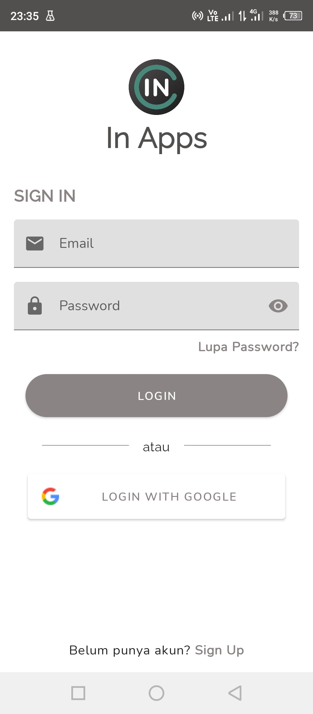  |  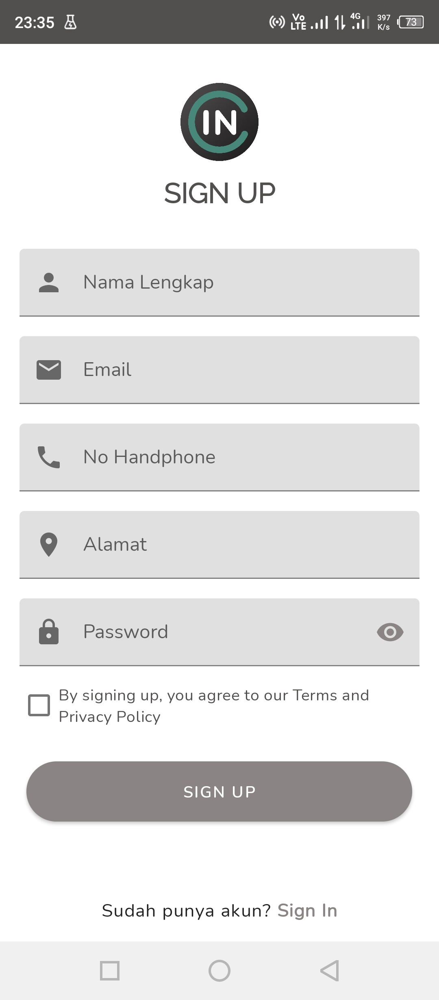  |  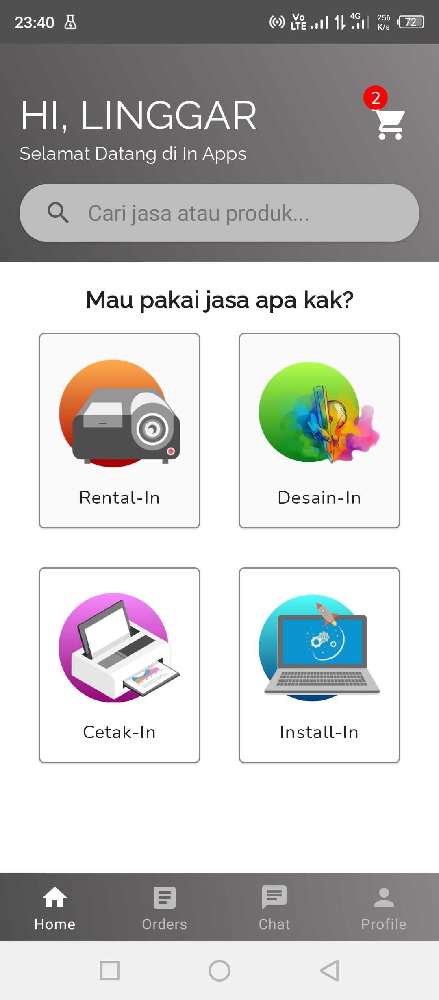
Rental-in Page | Rental-in Product Detail | Desain-in Page | Desain-in Product Detail
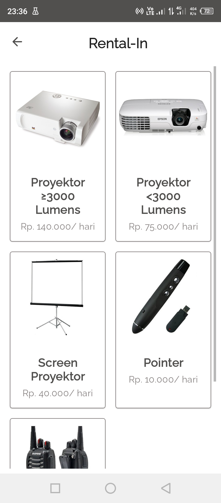  |  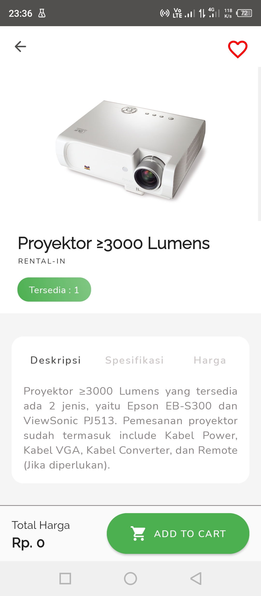  |  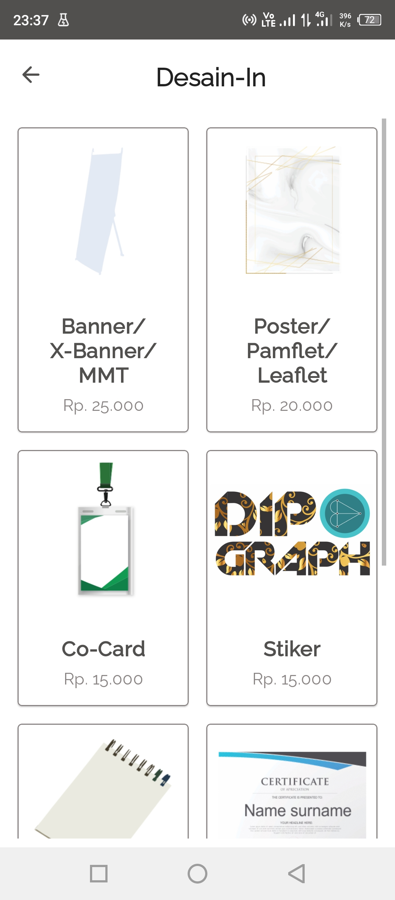  |  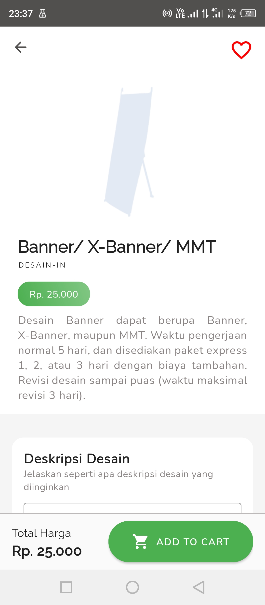
Cetak-in Page | Cetak-in Product Detail | Install-in Page | Add to Cart Message
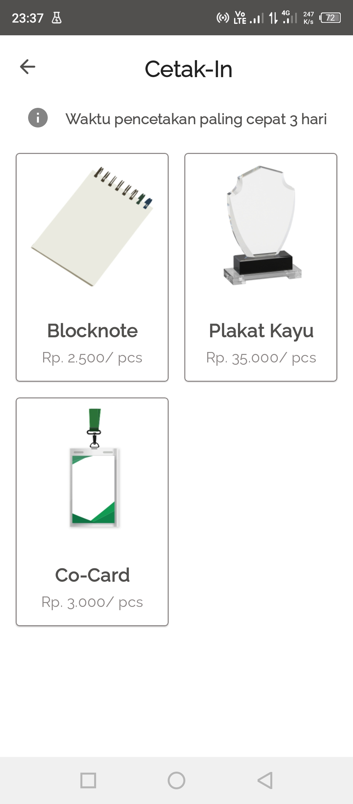  |  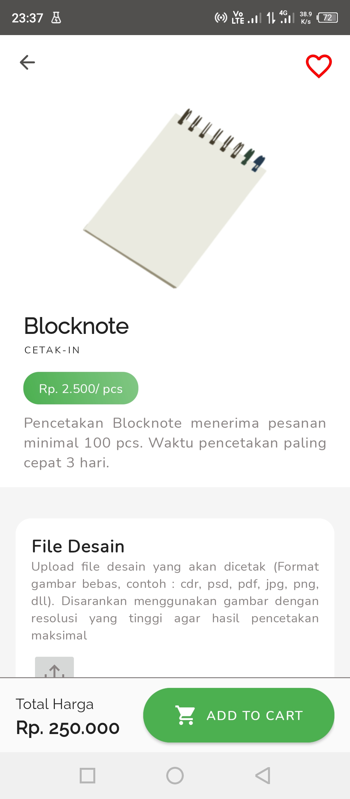  |  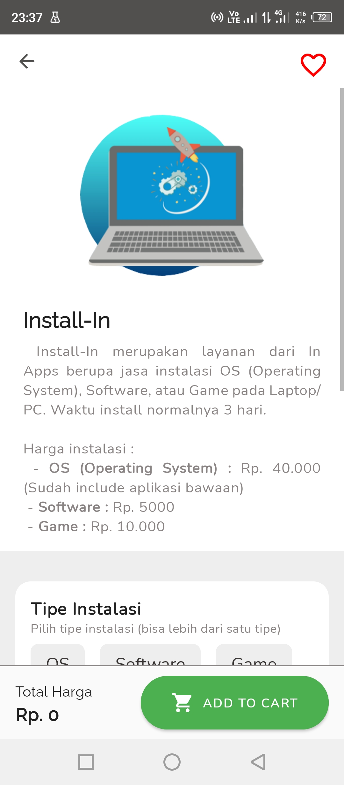  |  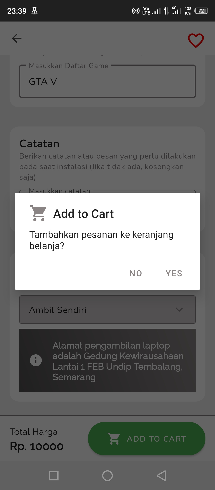
Cart Page | Checkout Page | Orders Page | Order Detail
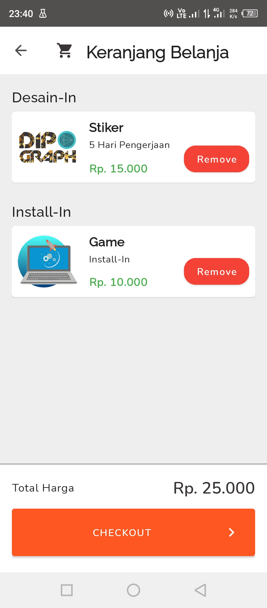  |  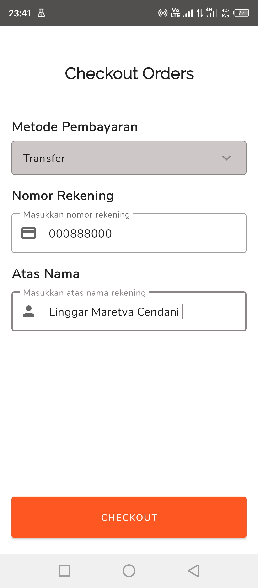  |    |  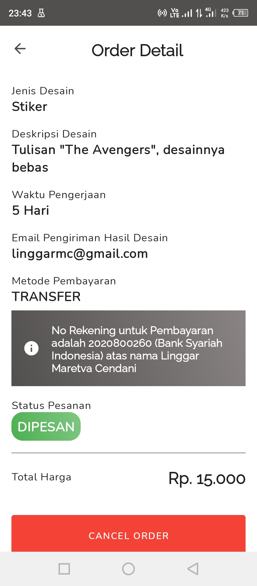
Chat Page | Profile Page | Edit Profile Page
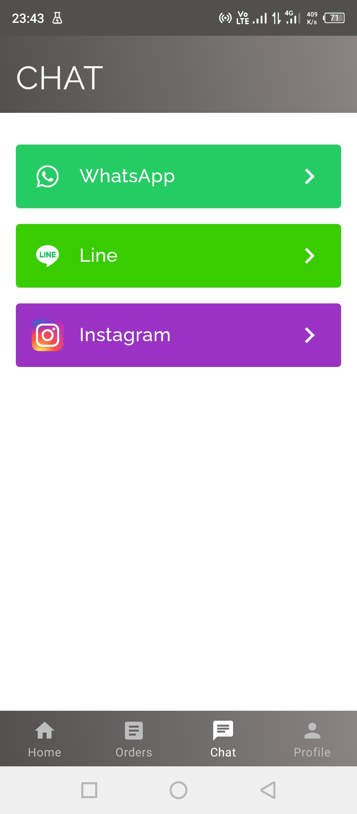  |  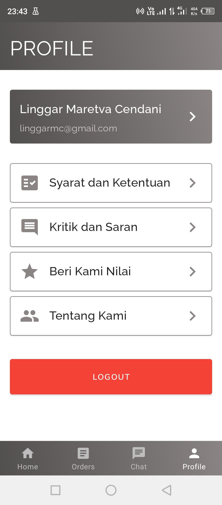  |  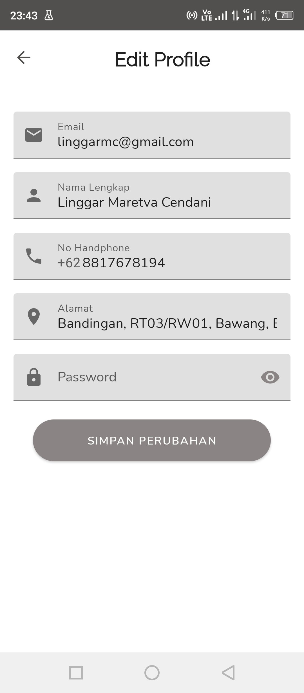

## Technology Used
* Android Studio
* Kotlin Programming Language
* Object-oriented Programming
* Material Design
* Firebase Auth
* Firebase Firestore
* Firebase Storage
* Firebase Crashlytics
* Room Database
* Preference Library
* Glide
* Lottie

## Installation
You can install this app on your android phone by downloading the APK file in [app/release/app-release.apk](app/release/app-release.apk). Open it on your android phone, and follow the installation process.

## Awards
* Program Kreativitas Mahasiswa - Kewirausahaan (PKM-K) 2019 Funding
* Program Mahasiswa Wirausaha (PMW) 2020 Funding
* No. 2 Favorite Startup in PKM Expo 2019

## Publications
* Semarangpos News: [Mahasiswa Undip Bikin Aplikasi Jasa Online, Banyak Pilihannya](https://www.semarangpos.com/mahasiswa-undip-bikin-aplikasi-jasa-online-banyak-pilihannya-1005047)
* KampusUndip News: [In Corps, Aplikasi Bisnis Online Berbasis Android Karya Mahasiswa Undip](http://www.kampusundip.com/2019/07/pkm-undip-in-corps.html)
* Paper Publications: [Cendani, L. M., Santoso, J., Ramadhani, H., Bintoro, B. B., Grahandika, G., & Khabibah, S. (2018). *Development of Android-based In-Apps Application Using Waterfall SDLC Method*. (unpublished)](Publications/ijetrm_Artikel%20Ilmiah%20In%20Apps.pdf)
